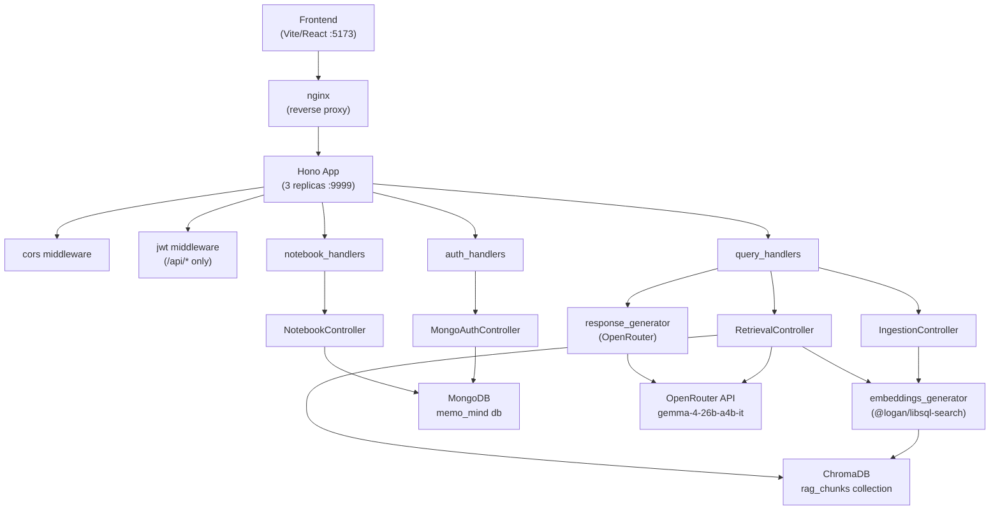

# MemoMind Backend — Architecture

## System Overview

This is a **layered monolith** — a single Deno process that handles all concerns: HTTP routing, business logic, embedding generation, vector search, and LLM calls. There are no background queues or separate workers; everything happens synchronously in the request lifecycle. The three distinct external dependencies (MongoDB, ChromaDB, OpenRouter) are kept behind thin client wrappers so they can be swapped independently.

The HTTP boundary is a Hono app. Inside that boundary, layers are enforced by directory convention: handlers parse HTTP and call controllers; controllers orchestrate business logic and call services or DB clients; services and infra clients know nothing about HTTP. Controllers are injected into Hono's context object at startup, keeping the layers decoupled from Hono internals.

For deployment, the service runs as 3 identical Deno replicas behind an nginx reverse-proxy. All replicas share the same MongoDB and ChromaDB instances over a Docker `back-tier` network. The frontend talks to nginx on the `front-tier` network.

---

## Architecture Diagram



---

## Components

| Component | Location | Responsibility | Interfaces with |
|-----------|----------|---------------|-----------------|
| **App factory** | `src/app.ts` | Assembles Hono app: registers middleware, injects controllers into context, mounts routes | All handlers, all middleware |
| **main.ts** | `main.ts` | Connects to MongoDB + ChromaDB, instantiates all controllers, starts Deno server on :9999 | `src/app.ts`, `src/infra/database/` |
| **auth_handlers** | `src/api/handler/auth_handlers.ts` | Parses login request, calls controller, signs and sets JWT cookie | `MongoAuthController` |
| **query_handlers** | `src/api/handler/query_handlers.ts` | Handles ingest (PDF/text → embeddings) and retrieve (query → LLM answer + history) | `IngestionController`, `RetrievalController`, `NotebookController`, `response_generator` |
| **notebook_handlers** | `src/api/handler/notebook_handlers.ts` | CRUD for notebooks; reads JWT payload for userId scoping | `NotebookController` |
| **MongoAuthController** | `src/controllers/auth_controller.ts` | Login: finds user or creates new one (upsert-style); no separate registration endpoint | MongoDB `users` collection |
| **NotebookController** | `src/controllers/notebook_controller.ts` | Notebook CRUD + interaction persistence; tracks ingest count | MongoDB `notebooks` + `interaction` collections |
| **IngestionController** | `src/controllers/ingestion_controller.ts` | Tokenizes text → generates embeddings → writes to ChromaDB | `embeddings_generator`, ChromaDB |
| **RetrievalController** | `src/controllers/retrieval_controller.ts` | Iterative retrieval: embed query → ChromaDB search → LLM evaluates sufficiency → repeat up to 3× | `embeddings_generator`, ChromaDB, OpenRouter |
| **embeddings_generator** | `src/services/rag/embeddings_generator.ts` | Sentence-based chunking (3 sentences, 1 overlap) + local 768-dim embedding via `@logan/libsql-search` | (pure functions) |
| **response_generator** | `src/services/rag/response_generator.ts` | Builds system prompt from retrieved chunks + last 10 interactions, calls OpenRouter | OpenRouter |
| **ChromaDB client** | `src/infra/database/chrom_db.ts` | Singleton ChromaDB connection; creates `rag_chunks` collection on first access | ChromaDB service |
| **MongoDB client** | `src/infra/database/mongo_db.ts` | Singleton MongoDB connection to `memo_mind` database | MongoDB service |

---

## Data Flow Summary

**Ingestion:** `POST /api/ingest` receives a `multipart/form-data` body with `text`, `notebookId`, and an optional PDF `file`. The text is split into overlapping 3-sentence chunks, each chunk is independently embedded (768-float vectors) using a local model, and all chunks are written to ChromaDB tagged with `{ userId, chatId: notebookId, timestamp }`. The notebook document in MongoDB is updated to mark that an ingest has occurred.

**Retrieval:** `POST /api/retrieve` receives `{ text, notebookId }`. The query is first saved as an interaction. Then the query text is embedded and used to search ChromaDB (top-10, filtered by `userId + notebookId`). An LLM evaluator (Gemma via OpenRouter) judges whether the returned chunks are sufficient; if not, it proposes follow-up queries and the search repeats (max 3 loops). Once chunks are accepted, the final LLM call receives the chunks as system context plus the last 10 conversation turns as history and produces the answer. Both query and answer are stored as interactions in MongoDB.

---

## Infrastructure

```
compose.yaml (one level up at ../compose.yaml)
├── nginx            — reverse proxy on front-tier network
├── backend (×3)    — Deno replicas on both front-tier and back-tier networks
├── mongo            — MongoDB on back-tier
└── chroma           — ChromaDB on back-tier
```

The `Dockerfile` at the repo root copies `deno.json` + `deno.lock`, runs `deno install` to cache dependencies, then copies source. Starts via `deno task start`. Port 9999 is exposed.

`.env.stage` overrides `MONGO_URL=mongodb://mongo:27017` and `CHROMA_DB_URL=chroma` to use Docker service hostnames on the internal network.
