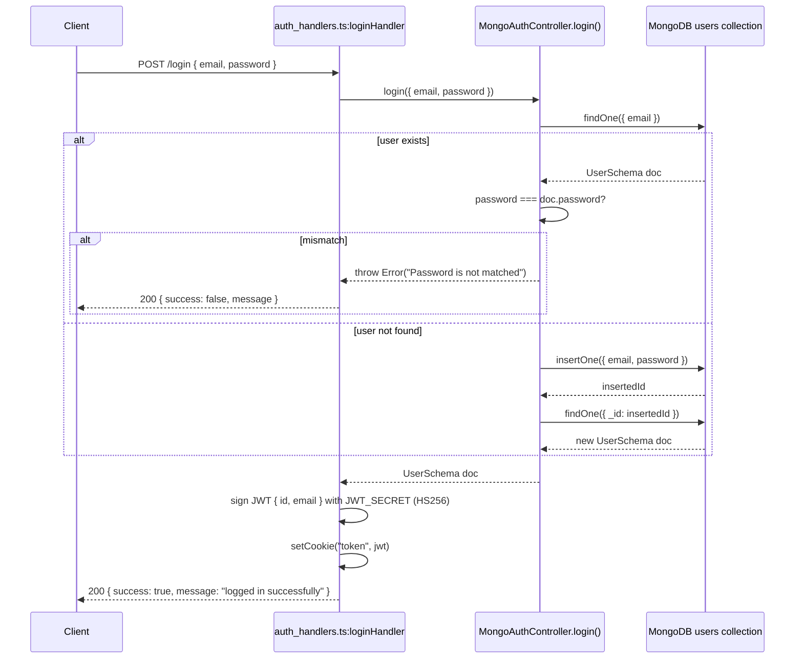
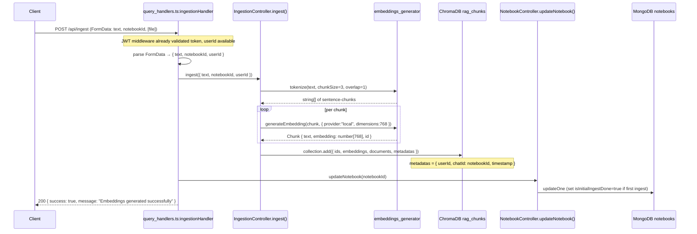
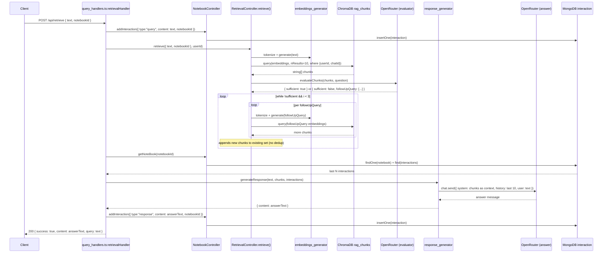

# MemoMind Backend — Code Flows

---

## Flow 1: Login (Auto-register if new user)

**Trigger:** `POST /login` with JSON `{ email, password }`  
**Path:** `auth_handlers.ts` → `MongoAuthController.login()` → MongoDB `users` → JWT cookie set

### Step-by-step

1. **`src/api/handler/auth_handlers.ts:loginHandler`** — reads JSON body, delegates to controller
2. **`src/controllers/auth_controller.ts:MongoAuthController.login()`** — looks up user by email; if found, validates password; if not found, inserts the user (login = auto-register on first call)
3. **`src/api/handler/auth_handlers.ts`** — signs a JWT carrying `{ id, email }` and sets it as an HTTP-only cookie named `token`
4. All subsequent `/api/*` routes read this cookie via Hono's `jwtMiddleware` and expose the payload as `c.get("jwtPayload")`

> **Gotcha:** There is no separate registration endpoint. First login with a new email silently creates the account.

---

## Flow 2: Document Ingestion

**Trigger:** `POST /api/ingest` (FormData: `text`, `notebookId`, optional `file` PDF)  
**Path:** `query_handlers.ts` → `IngestionController.ingest()` → `embeddings_generator` → ChromaDB, then `NotebookController.updateNotebook()` → MongoDB

### Step-by-step

1. **`src/api/handler/query_handlers.ts:ingestionHandler`** — extracts `text`, `notebookId`, `userId` (from JWT payload) from FormData; handles optional PDF file (currently only logs text, does not feed it to ingestion — see Gotchas doc)
2. **`src/controllers/ingestion_controller.ts:IngestionController.ingest()`** — calls tokenize then loops over chunks to generate embeddings
3. **`src/services/rag/embeddings_generator.ts:tokenize()`** — splits on sentence-ending punctuation (`.!?`), groups into windows of 3 with 1-sentence overlap
4. **`src/services/rag/embeddings_generator.ts:generate()`** — calls `@logan/libsql-search:generateEmbedding` locally for each chunk; 768-dimensional vectors
5. **ChromaDB `rag_chunks`** — stores vectors with metadata so they can later be filtered by `userId + notebookId`
6. **`NotebookController.updateNotebook()`** — atomic MongoDB update: flips `isInitialIngestDone` to `true` on first ingest only; does not increment `ingestCount` after that

---

## Flow 3: Query / Retrieval (the main RAG loop)

**Trigger:** `POST /api/retrieve` with JSON `{ text, notebookId }`  
**Path:** `query_handlers.ts` → save query interaction → `RetrievalController.retrieve()` (iterative) → `generateResponse()` → save response interaction → return answer

### Step-by-step

1. **`retrievalHandler`** — saves the user's query as a `type:"query"` interaction immediately (before retrieval, so it's in history on next turn)
2. **`RetrievalController.retrieve()`** — embeds the query, searches ChromaDB top-10 filtered by userId+notebookId
3. **`RetrievalController.evaluateChunks()`** — sends chunks + question to Gemma via OpenRouter; expects raw JSON back (`{ "sufficient": true }` or `{ "sufficient": false, "followUpQuery": [...] }`). No retry/fallback if JSON parsing fails.
4. **Iteration loop** — if not sufficient, embeds each follow-up query and concatenates new results. Counter `i` increments each outer loop, but the `while` condition checks `evalRes.sufficient` which is set only once before the loop — **the loop will always run 3 times if initially insufficient** (see Gotchas)
5. **`NotebookController.getNoteBook()`** — fetches all interactions for this notebook; `generateResponse` uses `slice(-10)` to limit to last 10
6. **`generateResponse()`** — builds system prompt from retrieved chunks, prepends chat history, sends to Gemma for final answer
7. **`retrievalHandler`** — saves the LLM answer as `type:"response"` interaction

---

## Flow 4: Notebook CRUD

**Trigger:** Various `GET/POST /api/notebook/*` routes (all JWT-protected)

These are straightforward CRUD operations. The interesting piece is how `userId` scoping works:

- **Create** (`POST /api/notebook/create`): handler reads `jwtPayload.id`, converts to `ObjectId`, passes as `userId` on the notebook document
- **Get all** (`GET /api/notebook/get-all`): `NotebookController.getAllNotebook(id)` filters `{ userId: new ObjectId(id) }` — only returns notebooks owned by the caller
- **Get one** (`GET /api/notebook/get/:id`): returns notebook + all its interactions (no userId check on this route — anyone with the ID can fetch it)
- **Delete** (`GET /api/notebook/delete/:id`): cascades — deletes notebook doc **and** all interactions with matching `notebookId`

> **Note:** Delete uses `GET` method, not `DELETE` — a REST convention deviation worth knowing.
