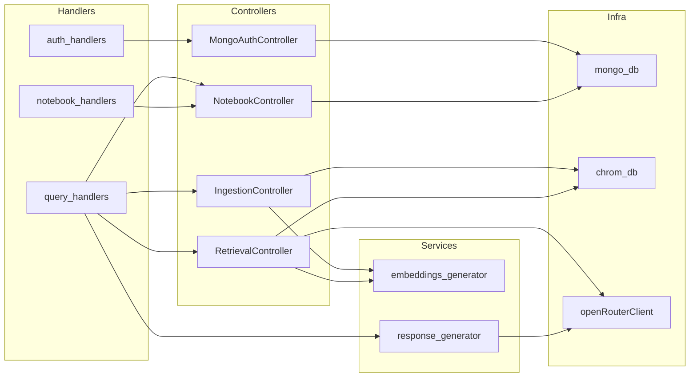

# MemoMind Backend — Services & Modules

---

## MongoAuthController

- **Location**: `src/controllers/auth_controller.ts`
- **Purpose**: Login + implicit registration for users
- **Public interface**:
  - `login(body: LoginBody): Promise<WithId<UserSchema>>`
- **Dependencies**: MongoDB `users` collection
- **Called by**: `auth_handlers.ts:loginHandler`
- **Notes**: No `register()` method. `login()` does `findOne` by email; if user is missing it inserts them — effectively a "login or create" operation. Passwords are stored and compared in plain text (no hashing).

---

## NotebookController

- **Location**: `src/controllers/notebook_controller.ts`
- **Purpose**: Full lifecycle management for notebooks and their interaction history
- **Public interface**:
  - `createNotebook(body: { name: string; userId: ObjectId }): Promise<ObjectId>`
  - `getAllNotebook(id: string): Promise<Notebook[]>`
  - `getNoteBook(notebookId: string): Promise<{ interactions, initialIngestDone }>`
  - `deleteNoteBook(notebookId: string): Promise<WithId<Notebook> | null>`
  - `addInteraction(body: Interaction): Promise<void>`
  - `updateNotebook(notebookId: string): Promise<void>`
- **Dependencies**: MongoDB `notebooks` collection, MongoDB `interaction` collection
- **Called by**: `notebook_handlers.ts`, `query_handlers.ts`
- **Notes**: `updateNotebook` uses a MongoDB pipeline update — sets `isInitialIngestDone = true` on first ingest only; `ingestCount` only increments when `isInitialIngestDone` is still `false`. `deleteNoteBook` cascades: deletes all interactions with matching `notebookId`.

---

## RetrievalController

- **Location**: `src/controllers/retrieval_controller.ts`
- **Purpose**: Orchestrates the iterative RAG retrieval loop
- **Public interface**:
  - `retrieve(body: RequestBody, userId: string): Promise<string[]>`
  - `search(body: RequestBody, userId: string): Promise<string[]>`
  - `evaluateChunks(chunks: string[], question: string): Promise<EvaluationResult>`
- **Dependencies**: ChromaDB `rag_chunks` collection, `embeddings_generator`, OpenRouter
- **Called by**: `query_handlers.ts:retrievalHandler`
- **Notes**: `evaluateChunks` expects the LLM to return raw JSON with no markdown wrapping. If the model wraps it in a code fence, `JSON.parse` will throw. The while-loop bug (see Gotchas) means the loop always runs 3 times when initially insufficient. `search()` returns `results.documents[0]` — only the first query result set, which is the right index when sending a single query embedding.

---

## IngestionController

- **Location**: `src/controllers/ingestion_controller.ts`
- **Purpose**: Tokenizes text and writes embeddings to ChromaDB
- **Public interface**:
  - `ingest(body: { text: string; notebookId: string; userId: string }): Promise<void>`
- **Dependencies**: ChromaDB `rag_chunks` collection, `embeddings_generator`
- **Called by**: `query_handlers.ts:ingestionHandler`
- **Notes**: Chunk IDs are generated as `` `${10}_${10}_${Date.now()}_${i}` `` — the two hardcoded `10`s appear to be placeholders for `userId` and `notebookId`, never wired up. IDs may collide if two ingestions start in the same millisecond.

---

## embeddings_generator

- **Location**: `src/services/rag/embeddings_generator.ts`
- **Purpose**: Sentence chunking and local embedding generation
- **Public interface**:
  - `tokenize(content: string, chunkSize?: number, overlap?: number): string[]`
  - `generate(text: string[]): Promise<Chunk[]>`
- **Dependencies**: `@logan/libsql-search` (local FFI model, 768 dimensions)
- **Called by**: `IngestionController`, `RetrievalController`
- **Notes**: `tokenize` splits on `/[^.!?]+[.!?]+/g` — only matches sentences that end with punctuation. Text without punctuation (lists, headings, code) produces zero chunks. Overlap is 1 sentence by default.

---

## response_generator

- **Location**: `src/services/rag/response_generator.ts`
- **Purpose**: Final LLM call that produces the answer shown to the user
- **Public interface**:
  - `generateResponse(question: string, chunks: string[], interactions: WithId<Interaction>[]): Promise<Message>`
  - `generateResponseUsingOllama(question: string, chunks: string[]): Promise<string>` *(unused in main path)*
- **Dependencies**: OpenRouter (`openRouterClient`), MongoDB interactions
- **Called by**: `query_handlers.ts:retrievalHandler`
- **Notes**: Uses `interactions.slice(-10)` for history window. Converts interactions to chat messages: `type:"query"` → `role:"user"`, `type:"response"` → `role:"assistant"`. The Ollama variant is dead code — it points to `localhost:11434` and is not called from any handler.

---

## embeddings_retriver (legacy)

- **Location**: `src/services/rag/embeddings_retriver.ts`
- **Purpose**: In-memory cosine similarity search
- **Public interface**:
  - `retrieve(memory: Memory, query: Chunk[], k?: number): RetrievedChunks[]`
- **Notes**: This is dead code from an earlier architecture where embeddings were stored in memory rather than ChromaDB. Not called anywhere in the current codebase.

---

## openRouterClient

- **Location**: `src/infra/clients/open_router.ts`
- **Purpose**: Singleton OpenRouter SDK client
- **Notes**: Initialized at module load time with `OPEN_ROUTER_API_KEY`. Used by both `RetrievalController` (evaluation) and `response_generator` (answer generation).

---

## ChromaDB client (`documents`)

- **Location**: `src/infra/database/chrom_db.ts`
- **Purpose**: Singleton ChromaDB collection handle
- **Notes**: Top-level `await` — blocks module initialization until ChromaDB is reachable. Collection name `rag_chunks` is hardcoded. `embeddingFunction: null` because embeddings are generated manually before being passed to ChromaDB.

---

## MongoDB client (`getDB`)

- **Location**: `src/infra/database/mongo_db.ts`
- **Purpose**: Singleton MongoDB connection returning the `memo_mind` database
- **Notes**: Lazy connect — only connects on first `getDB()` call. Connection is cached in module-level `db` variable.

---

## Dependency Graph

