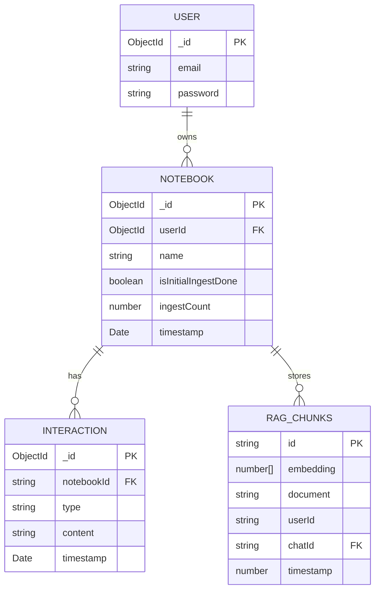

# MemoMind Backend — Data Models

There is no ORM or schema migration system. Schemas are implicit in TypeScript types (`src/shared/types/types.ts`) and enforced only by application code at insert time.

---

## UserSchema

**Source**: `src/shared/types/types.ts`, stored in MongoDB `memo_mind.users`

| Field | Type | Required | Notes |
|-------|------|----------|-------|
| _id | ObjectId | auto | MongoDB primary key |
| email | string | ✓ | Used as login identifier; not enforced unique at DB level |
| password | string | ✓ | **Plain text — no hashing** |

**Notes**: There is no registration endpoint; users are created on first `POST /login`. No email uniqueness index — two accounts with the same email could theoretically be created in a race condition.

---

## Notebook

**Source**: `src/shared/types/types.ts`, stored in MongoDB `memo_mind.notebooks`

| Field | Type | Required | Notes |
|-------|------|----------|-------|
| _id | ObjectId | auto | MongoDB primary key |
| name | string | ✓ | User-provided notebook name |
| userId | ObjectId | ✓ | Owner; used to scope all queries |
| isInitialIngestDone | boolean | ✓ | False until first successful ingest |
| ingestCount | number | ✓ | Starts at 0; only increments on first ingest (logic bug — see Gotchas) |
| interactions | Interaction[] | ✓ | **Unused** — interactions are stored in a separate collection; this array is always `[]` |
| timestamp | Date | ✓ | Creation time |

**Notes**: The `interactions` array field in the notebook document is set to `[]` on creation and never updated. All actual interaction history lives in the separate `interaction` collection.

---

## Interaction

**Source**: `src/shared/types/types.ts`, stored in MongoDB `memo_mind.interaction`

| Field | Type | Required | Notes |
|-------|------|----------|-------|
| _id | ObjectId | auto | MongoDB primary key |
| type | `"query"` \| `"response"` | ✓ | Distinguishes user message from LLM answer |
| content | string | ✓ | Raw text of query or response |
| timestamp | Date | ✓ | Set at handler level |
| notebookId | string | ✓ | String (not ObjectId) — references notebooks._id as string |

**Notes**: `notebookId` is stored as a plain string, not an ObjectId reference. The retrieval filter `{ notebookId: notebookId }` works because it's always passed as a string. However, there is no foreign key enforcement — deleting a notebook cascades deletions via application code in `deleteNoteBook()`.

---

## ChromaDB: rag_chunks

**Source**: `src/infra/database/chrom_db.ts`, `src/controllers/ingestion_controller.ts`

ChromaDB stores vectors in a flat collection `rag_chunks`. Each entry:

| Field | Type | Notes |
|-------|------|-------|
| id | string | Format: `"10_10_<timestamp>_<chunkIndex>"` — the two `10`s are hardcoded placeholders |
| embedding | number[768] | Local 768-dim embedding from `@logan/libsql-search` |
| document | string | Raw chunk text |
| metadata.userId | string | Owner ID — used in `$eq` filter at query time |
| metadata.chatId | string | `notebookId` — used in `$eq` filter at query time |
| metadata.timestamp | number | Unix ms timestamp of ingest |

**Notes**: Both `userId` and `chatId` (notebookId) must match for a chunk to be returned. This means retrieval is always scoped to a single notebook, preventing cross-notebook leakage.

---

## API Request/Response Types

### RequestBody (retrieve + ingest)
```ts
{ text: string; notebookId: string }
```

### SuccessResponse<T>
```ts
{ success: true; data: T; message: string }
```

### ErrorResponse
```ts
{ success: false; message: string }
```

---

## Entity Relationship Diagram


